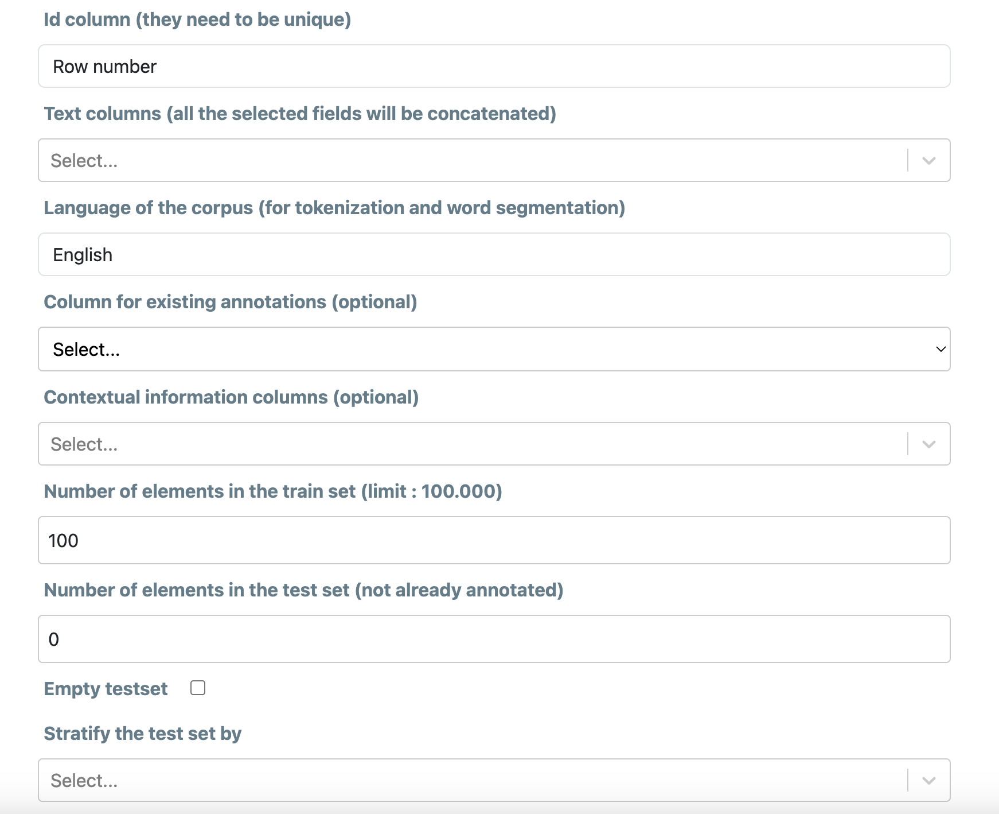
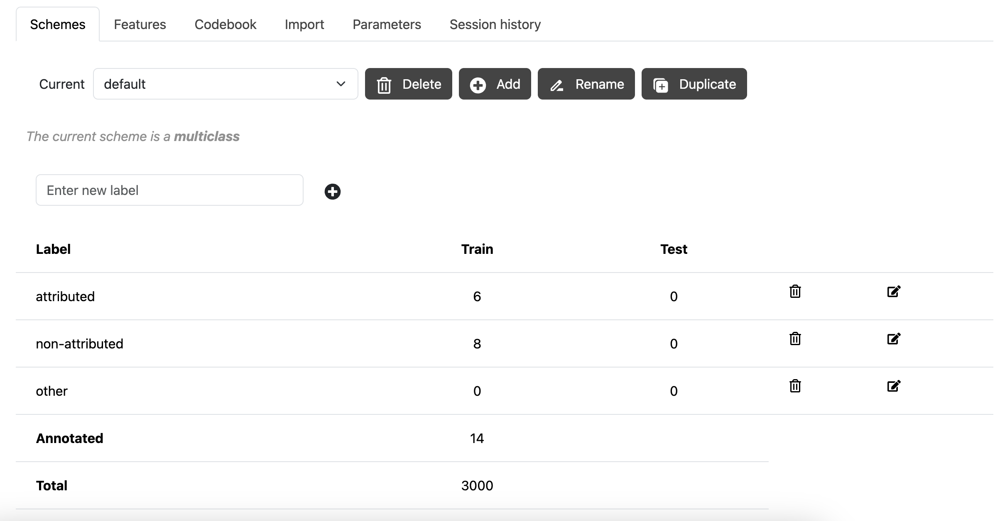
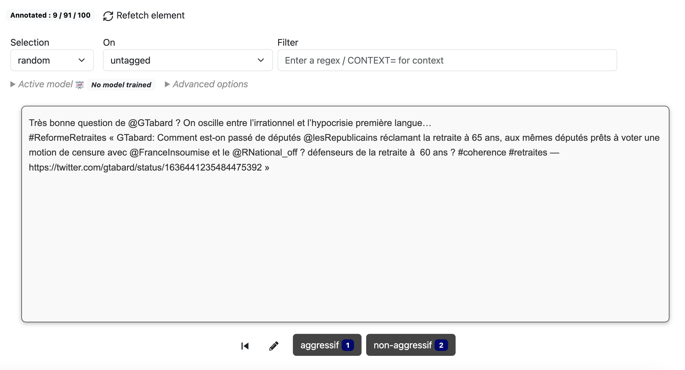
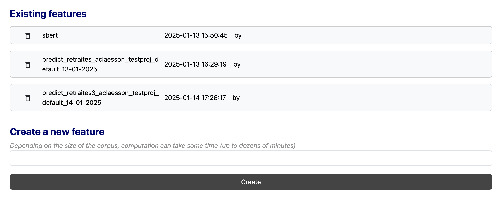
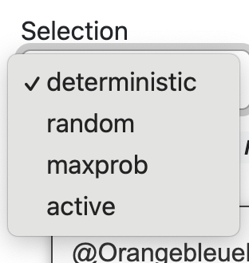
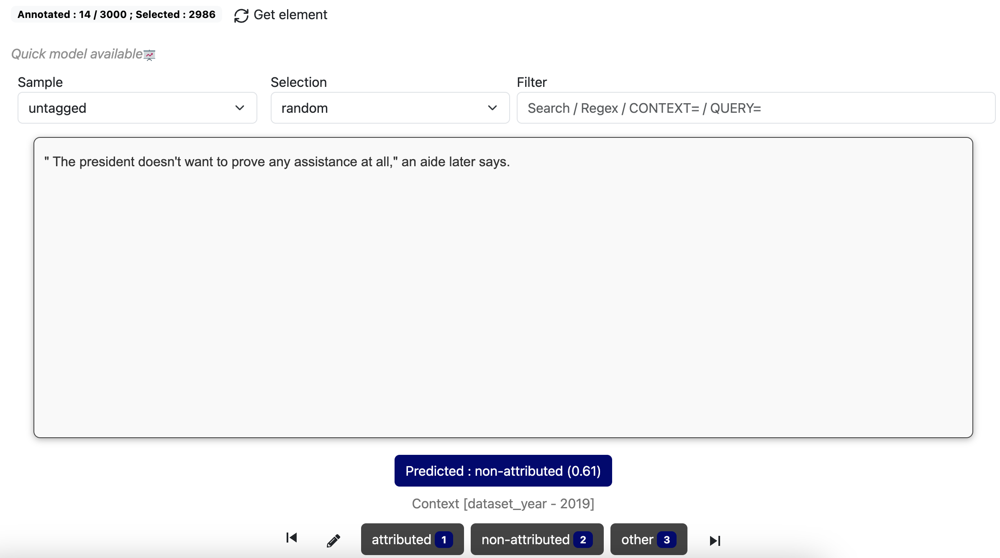
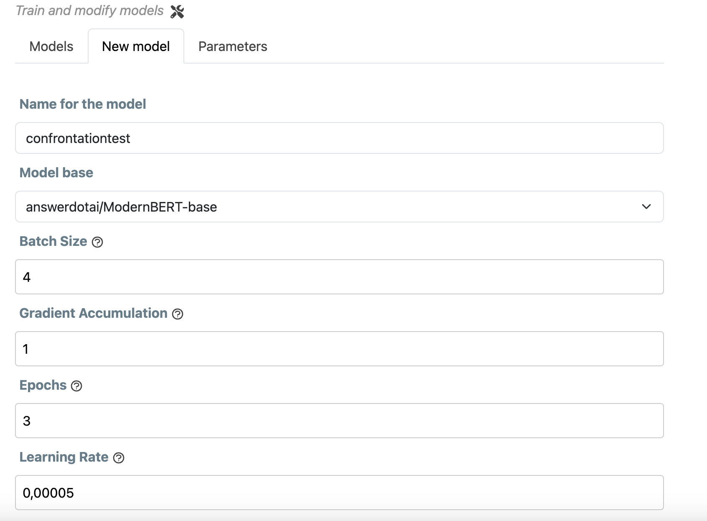

# ActiveTigger Quickstart

This is how to get started with your annotation project using ActiveTigger. 

ActiveTigger is a tool that will be useful if you want to:

- Quickly annotate a text-based dataset in a dedicated collaborative interface
- Train a model on a small set of annotated data to extend it on a larger corpus

This guide explains the basics of all functionalities, but you do not have to use all of them for your project. For example, if you only want to use ActiveTigger for manual annotation, focus on the sections detailing how to set up and export your project data.

!!! warning "ActiveTigger is in beta"

    ActiveTigger is still in its beta version, and we are working on improving it. If you encounter any issues (or you have suggestions), please let us know on [Github issues](https://github.com/emilienschultz/activetigger/issues)

_Note: ActiveTigger currently only works for multiclass/multilabel annotation, not span annotation._

## Table of contents

1. [Creating a project](#creating-a-project)
2. [Workflow](#workflow)
3. [Project](#project-page)
4. [Tag](#tag)
5. [Fine-tune](#fine-tune)
6. [Export](#export)
7. [User management](#user-management)
8. [Account](#account)
9.[Storage](#storage)
10.[Further resources](#further-resources)

## Creating a project

The first step is to create a project. Creating the project is the most important step, since it will define the framework of your annotation process.

First, you need to import **raw data** : a `csv`, `xlsx` or `parquet` file with your texts separated at the level you wish to annotate (sentences, paragraphs, social media posts, articles...). Each element should be a row. These will be loaded as the elements that you can individually annotate. It is up to you to produce this file.

Give your project a name (the **project name**). Each name is unique in the application and will allow you to identify your project.

!!! info "Name and id can be transformed by the process"

    Both the project name and the ID will be transformed to be url-compatible. This means for instance that accentuated characters will be replaced by their non-accentuated equivalent, and spaces/underscores will be replaced by a dash. Do anticipate if you need to match this data further in the process with other informations.

Specify the name of the column that contains the unique (numerical or textual) IDs for each element (**id columns**), and the name of the column (or columns) that contains the text (**text(s) columns**). Specify the language of the texts (used to priorize models and options in feature computation).

If the file has already been annotated and you want to import these annotations, you can specify the column of **existing annotations**. 

Optionally, if there are **context elements** that you want to display while annotating (for example the author, the date, the publication...), you can specify the relevant columns here. You can view this information when annotating by going to Display Parameters and clicking on Contextual Information.

The next step is to define both the **training dataset** that you will annotate and an optional **test dataset** that can be used for model evaluation.

The **training dataset** is the most important since it will constitute the elements that you will be able to see and annotate. The underlying idea is that all computation will be limited to this dataset during the first phases of your project.

You need to specify the number of elements you want in each dataset. Those elements will be then picked randomly in the **raw data**, prioritizing elements that have already been annotated if any for the **training dataset**.

Using a test set is not mandatory. If you would like to validate your model on a test set, this will also be possible at a later stage further down the line.

It is possible to stratify the elements of the test set, ensuring that each category of a given variable is equally represented. For example, if annotating a press corpus, you can ensure that the proportion of articles from Newspaper A and Newspaper B remains the same, even if their overall distribution in the corpus is uneven.

!!! info "Size of the dataset"

Once the project is created, you can start working on it.

!!! info "Visibility"

    By default, a project is only visible to the user who created it (and the administrator of the service). You can add users on a project if you want to work collaboratively.

## Workflow

Once you have created your project, below are the suggested steps that will help you develop, evaluate, and apply your model:

- Define your labels in your coding scheme
- Tag at least a couple hundred (randomly selected) elements (at least a few dozen per label)
- Train a Quick Model: define features under **Project**, train Quick Model under **Tag**
- Go back and annotate, alternating between Active Learning and random modes to ensure a diverse pool of annotated data in your training dataset. Check performance metrics (scores, visualizations) periodically to assess your annotation strategy.
- Once content with preliminary prediction performance, train a full BERT model under **Fine-tune**. You may need to go back and revise your annotation strategy if you are not happy with model performance.
- Once content with your fine-tuned model, apply it on a test set (unseen data) to evaluate it more robustly.
- Once content with these results, apply your model on the full dataset.
- Export the results and proceed with your analysis.

In this guide, we go into more detail on each of these steps, going through the Active Tigger interface tab by tab.

## Project

Click on the name of your project in the left-hand menu to see a summary of your where your project is at.

Each project can have several **coding schemes**. A scheme is a set of specific labels that you can use to annotate the corpus. Each scheme works as an independant layer of annotation. One is created by default when you create a project.

You can create a new coding scheme or delete an old one in the menu at the top. Creating a new coding scheme means starting from zero, but will not modify previous coding schemes. You can toggle between schemes as you go.

!!! info "Coding schemes"

    There are two different coding schemes : multi-class and multi-label (the latter is still in experimental phase). Multi-class means one label per element; multi-label means several labels per element. You cannot switch between them, and multi-label are for the moment not completely implemented in the interface, so we recommand to test if the features you need are available.

You can also see a summary of all your current annotations (per category), a history of all your actions in the project, and a summary of the parameters you set up while creating your project. You can also delete the project in the Parameters tab once you finished with it.

!!! info "Destroy a project"

    Be aware that deleting a project will delete all your annotations and the project itself. This does also release space for other projects, so deleting projects you do not need is good practice.

Once you entered the annotation phase, you will have an history of already annotated elements. This is the session history. 

!!! warning "Session history"

    Be aware that you can only see any particular element once during a unique session, so if you need to re-annotate them, you will need to clear the history first.

### Prepare your project

#### Schemes

Before annotating, you need to define your labels. You do this by creating labels in a coding scheme.

We recommend keeping your labels quick. If you are aiming to train a model, binary categorizations tend to be easier to handle. For example, if you are annotating newspaper headlines, it is easier to classify it as "politics/not politics", rather than to include all possible subjects as multiple categories. You can layer different binary categorizations as different coding scheme, or add labels at a later stage.

Enter the name of each label under "New label" and click the plus sign.

You can also delete or replace labels. 

- If you want to delete a label, pick the relevant label under **Available labels** and then the trash bin. All existing annotations will be deleted.
- If you want to replace a label, pick the relevant label under **Available labels**, write the label's new name, and click the sign next to **Replace selected label**. All the existing annotations will be converted to the new label.

!!! info "Merging labels"

    If you want to merge 2 labels in one, you just have to rename one with the name of the other.

#### Features

The **Project** tab also lets you define the **features** you want to use for your model. 

Features means that each text element is represented by a numerical vector. This is necessary to train certain models (especially for active learning) or to do projections.

By default, we recommend using the SBERT feature, which is a pre-trained model that converts your text into a numerical representation. This is a good starting point for most projects.

#### Codebook

Under the **Codebook** tab, you can also include written instructions on how to distinguish your categories. It is helpful if you work collaboratively.

#### Import 

Here you can import:
- additional annotations to your train set (make sure they have the same id)
- a test set to validate your model (more on this below)

#### Parameters
Here you can see (or change, if needed) a summary of the main parameters for your project.

#### Session history

This tab logs all activities undertaken on your project (can be particularly helpful if you work with collaborators).

## Tag

The **Tag** tab is where you will spend most of your time. Here is where you annotate your data and perform your first measures to create and validate a model.

### Selection mode

In the Annotate section, the interface will pick out an element that you can annotate according to your pre-defined labels. Once you have validated an annotation, the interface will pick the next element for you following the **selection mode** that is configured. The ID of the element is displayed in the URL.

By default, the selection modes "deterministic" and "random" are available:

- **Deterministic** mode means that ActiveTigger will pick out each element in the order of the database, as created when creating your project.
- **Random** mode means that ActiveTigger will pick out the next element at random.

Click on **Get element** if you want to apply a new selection mode after modifying it.

The selection mode refers both the general rule of getting new elements (e.g. random) and specific rules, such as specified regular expressions (_regex_) patterns. You can search for elements with particular keywords or particular syntax patterns (regex). This could mean fishing out all elements that contain certain symbols, for example. If you are unfamiliar with regex patterns, [this generator](https://regex-generator.olafneumann.org/) can be a useful reference.

!!! info "Keyboard shortcuts"

    You can use the keyboard shortcuts to annotate faster. The number keys correspond to the labels you have defined. You can move the labels to change the order if needed.

!!! info "Add comment"

    You can add a comment to each annotation. This can be useful to explain why you chose a certain label, or to note any particularities about the text.

You can also : 
- go back to the previous annotated element (for instance, to re-annotate it)
- skip an element in the current session (it will not be annotated, and you will need to clean the session to be able to see it again)

### Active learning

**Active learning** is a method to accelerate the process of annotation and to improve dataset for model fine-tuning.

Often, we want to classify imbalanced datasets, i.e. where one category is much less represented in the data than the other. This can mean very lengthy annotation processes, if you go through each element in a random order hoping to stumble upon both of your categories. 

Using the already annotated data, ActiveTigger can find the elements that your current model is either _most certain_ or _most uncertain_ that it knows how to predict, given your existing coding scheme and annotations. Here is how to set it up:

First, make sure you have at least one _feature_ created under the **Prepare** tab (by default, we recommend SBERT).

Second, you need to **select features** under the Project tab and train a **Quick Model**

Once the quick prediction model is trained, you can now choose the _active_ and _maxprob_ selection modes when picking elements. That means you can use the prediction of this model to guide your selection.  

- **Active** mode means that Active Tigger will pick the elements on which it is most uncertain (where, based on previous annotations, it could be classified either way)
- **Maxprob** mode means that Active Tigger will pick the elements on which it is most certain (where, based on previous annotations, the model guesses where to categorize it with the highest levels of confidence).

When constructing your training dataset, we recommend starting in random mode in order to create a base of annotations on which to train a prediction model. There is no absolute minimum number. A couple dozen annotations representing both of your labels can serve as a base. By default, you need to retrain the model at will, but you can also configure it to be retrained every N steps.

If your aim is to train a model, we recommend alternating between active and maxprob mode in order to maximize the number of examples from both of your categories prioritizing on the _uncertain_ elements.

If displayed (see Display parameters), the **Prediction** button above your available labels indicates the model's prediction of a certain label (given previous annotations) and its level of certainty (you can deactivate it in **Display parameters**)

You can see, by **clicking on active model**, if your model works well on your data. 

The **Exact score** is calculated on all the data you have annotated. The model uses this same data for training and then evaluating its performance. It is normal for this score to be very high (close to 1.0), because the model has already seen all this data during training. For the **CV10 score** , the model automatically divides all your annotations into 10 equal parts and trains on 9 parts that represent 90% of the annotations. It does not take into account the remaining part, which corresponds to 10% of the annotations, during training. It then uses this set-aside part to test whether the model can correctly predict these annotations that it has not seen during training. Then it repeats the following operation 10 times. 

### Quick Model

Once you have annotated a sufficient number of examples (ideally a few hundred in total, at least around 50 per class/category) you can begin training classification models to assist and scale your annotation work. ActiveTigger supports a progressive workflow for model training.

**Training Quick Models to Evaluate Intermediary Performance**
You can train one or more "quick", intermediary models to see how well your model is performing based on your existing annotations. These can provide preliminary insights on baseline performance. This can help you in early stages of annotation, identifying cases where a model may struggle on ambiguities or other inconsistencies in your coding scheme/data. They will also permit you to use the **Active Learning** features.

- Define your features under Prepare tab (we recommend SBERT). This is a pre-trained model that converts your text into a numerical representation (embeddings). This also allows you to use the Visualization feature to see how this preliminary model groups texts. 
- Under **Create a new quick model**, you can set up the basic parameters for your quick model. We recommend keeping them at default for your first try.
- Optionally, you can tick the box to include a **10-fold cross validation**. This means that your quick model will "test itself" on your training data, 10 times. This gives you a first indication of your model's performance, but since you are using only training data, this should be taken with a grain of salt.
- Once you are done, you will see a series of metrics, of which the F1 score is generally the most interesting. See explanation of metrics under the **Fine-tune** section below.

Later, once you have trained a full BERT model (see **Fine-tune** section) you can also use this model instead of a quick model to make predictions.

You can the predictions of your latest (quick or no) model in visualizations, exporting predictions, and further annotation (active learning).

Once you feel that you may have a large enough set of annotations and your quick model shows signs of understanding your coding scheme, you can then train a larger model (see **Fine-tune** section) with more parameters that you can modify, which can serve to obtain even more precise annotations.
!!! info "Keep your coding scheme consistent"

    It can be tempting to adjust your annotations according to initial performance metrics (for example, a lower F1 score in a certain category may incite you to tag more examples as positives for this category). Ensure that your annotations are first and foremost consistent with your codebook. Mixing annotation strategies in the middle of the same scheme can cause issues with training models due to inconsistencies. If you are unhappy with model results, consider adjusting your codebook - maybe your categories are too vaguely defined? You can start a new coding scheme to test various annotation strategies.

### Tabular

This tab gives you an overview of all tagged elements. You can get a quick picture of their distribution in the dataset. If you want to relabel an element, you can do so by **double-clicking** on the assigned label.

### Vizualisation

To improve your coding, you can use the Visualization mode. Select your SBERT feature (you can also add your trained model if you have one), then click compute. This will project your models into two dimensions. This projection allows you to see how your models group similar texts naturally. You can either visualize the elements you have annotated or the model’s predictions. The separation (or overlap) of the different groups can give you a visual indication of your model's performance – clear separation suggests a model that distinguishes categories well. Points appearing in "incorrect regions" (e.g., isolated orange points in a mostly blue area) may indicate classification errors or interesting edge cases to analyze.

When you spot such cases, you can click on a point and annotate it. 

## Fine-tune

Active Tigger allows you to adapt a existing BERT classifier model on your annotated data. Once you did that, you can extend your annotation pattern on the complete dataset, or download this classifier for other uses. Basically, this is a process of fine-tuning: the pre-trained base model will be adjusted to your specific data.

Click on **Create** to train a new model.

Name it and pick which BERT model base you would like to use (note that some are language-specific, by default ModernBert in English and CamemBert in French).

You can adjust the parameters for the model, or leave it at default values.

Leave some time for the training process (you can follow the progress). Depending the parameters it will consume more or less computational power, especially GPU. It can take some time depending on the number of elements. Once the model is available, you can consult it under the **Models** tab.

!!! warning "GPU load"

    When available, the process will use GPU. Since resources are limited, overloads can happen. Consequently, a process can fail if there is no enough memory. You can follow the current state of the GPU use in the left menu of the screen. 

## Fine-tuned models

Once your model is trained, it will be selectable under this tab. At this point, you can evaluate its performance to decide to apply it on your data (train or test sets) to see metrics of its performance, or to extend it on the whole initial dataset.

Choose the name of the model under **Existing models**, click on the **Scores tab**, and click **Predict using train set**. it will use the model on the training dataset (so on the elements you haven't annotated yet).

Once the prediction is done, you will see a series of scores that allows you to evaluate the model's performance.:

- _F1 micro_: The harmonic mean of precision and recall, calculated globally without considering category imbalance.
- _F1 macro_: The harmonic mean of precision and recall calculated per class, treating all categories equally regardless of their size.
- _F1 weighted_: The harmonic mean of precision and recall calculated per class, weighted by the number of true instances in each category to account for imbalance.
- _F1_: The harmonic mean of precision and recall (shown per each label)
- _Precision_: Proportion of correctly predicted positive cases out of all predicted positives.
- _Recall_:  Proportion of correctly predicted positive cases out of all actual positives.
- _Accuracy_: Proportion of correctly classified elements out of total elements.

All of these variables tell you useful information about how your model performs, but the way you assess them depends on your research question. 

For example, say that you are classifying social media posts according to whether they express support for climate policies or not. A low precision score means many posts labeled as "supportive" are actually irrelevant or against climate change policies (false positives). A low recall means the model misses many supportive posts (false negatives). Improving precision might involve stricter rules for classifying posts as supportive (e.g., requiring multiple positive keywords). However, this could hurt recall, as subtle supportive posts might be overlooked.

The generic **F1 score** is often the variable most of interest, as it indicate how precision and recall are balanced. The closer the F1 score is to 1, the better the model performs according to the coding scheme you have trained it on. 

Active Tigger also provides a **confusion matrix**. You can read it as follows (for binary classifications: the first number represents the true negatives, meaning the documents correctly classified as belonging to the negative class. The second number represents the false positives (documents incorrectly classified as belonging to the positive class). The third number corresponds to the false negatives (documents incorrectly classified as not belonging to the positive class). Finally, the fourth number represents the true positives (documents correctly classified as belonging to the positive class).

If you find yourself with low scores, it is a good idea to first consider your coding scheme. Are your categories clear? Several rounds of iterative annotations are often necessary as you refine your approach. If you realize that you have annotated certain words ambiguously, you can revise your coding from the Explore tab.

To improve your score, you can also check in the False Prediction tab for texts where discrepancies between your coding and the model's coding is indicated. Try to understand the reason for the difference and revise your coding accordingly.

### Monitoring the Training Process

During model training, ActiveTigger displays loss curves for both training and evaluation datasets. These curves help you assess the model's learning progress. The overall goal should be to minimize **loss**: a number that tells us how far off the model's predictions are from the correct answers. It is the difference between the model's predictions and the actual labeled data.

CLick on **Predict on train set** to see the loss curves during training. 

During the traning phase, we calculate loss on training data. **Training loss** shows how well the model is doing on the examples it has already seen. **Evaluation loss** is measured on a separate sample of data that was not used during training. This gives a more realistic idea of how the model will perform on new, unseen data.

This will give you two curves. They should be interpreted as follows:
- Decreasing Loss: Indicates effective learning. If the loss remains flat, consider increasing the learning rate.
- Increasing Loss: Suggests the learning rate may be too high, try lowering it.
- Chaotic Loss Patterns: May indicate the model is learning from noise; adjust the learning rate accordingly.
Overfitting: If the evaluation loss is significantly higher than the training loss, the model may be overfitting (= the model "memorizes" rather than "learns" and will perform poorly on unseen data).
- Stalled Learning: If both curves are flat, consider reducing the number of epochs.

You can also adjust the batch size (= how many examples the model looks at before updating itself) and gradient accumulation (= simulating large-batch training). The product of these two settings gives the effective batch size, which is displayed in the interface.

These evaluation tools can help you define the parameters for your final model to be applied on the whole dataset.

Another way to improve your coding is by going to the Visualization tab (under the Annotate tab), which helps you identify ambiguous cases.

Once you find the model satisfactory, you can apply it to the whole dataset in the tab **Compute prediction**. This will apply the model to all the elements in the dataset, and you can then export the results.

### Test

If you have defined or imported a test set, you can also apply the model on it. This is useful to see how the model performs on unseen data. It is seen as good practice to validate a model on a dedicated test set. The first step is to import the test set, then to select "test set mode". You should then go the the annotation tab. Once you have annotated enough data, you can calculate your scores to see if your model is robust.

### Predict 

To extend the annotations across all your data, select a model that you have trained and click on « Launch prediction complete dataset ». The file (which you can export from the Export tab) will then provide the probability associated with each text in your dataset. 

You can also apply your model on data that hasn't been uploaded on the project with « Import external texts to predict ». 

## Export

You can export your total annotations in `csv`, `xlsx` or `parquet` format.

On the Export tab, select the desired format and click **Export training data**.

You can also export the features and models you have trained if you wish to use them elsewhere.

## User management

You can add users to your project. This is useful if you want to work collaboratively on a project.

!!! note "Create user"

    The right to create users is currently restricted.

## Account

You can change your password.

## Storage

Please make sure to regularly delete unused models and archive projects no longer in active use, as these will take up unnecessary space.

## Further resources

- [Interpreting Loss Curves – Google ML Crash Course (in French)](https://developers.google.com/machine-learning/crash-course/overfitting/interpreting-loss-curves?hl=fr)
- [A Deep Dive Into Learning Curves in Machine Learning – Weights & Biases](https://wandb.ai/mostafaibrahim17/ml-articles/reports/A-Deep-Dive-Into-Learning-Curves-in-Machine-Learning--Vmlldzo0NjA1ODY0)

