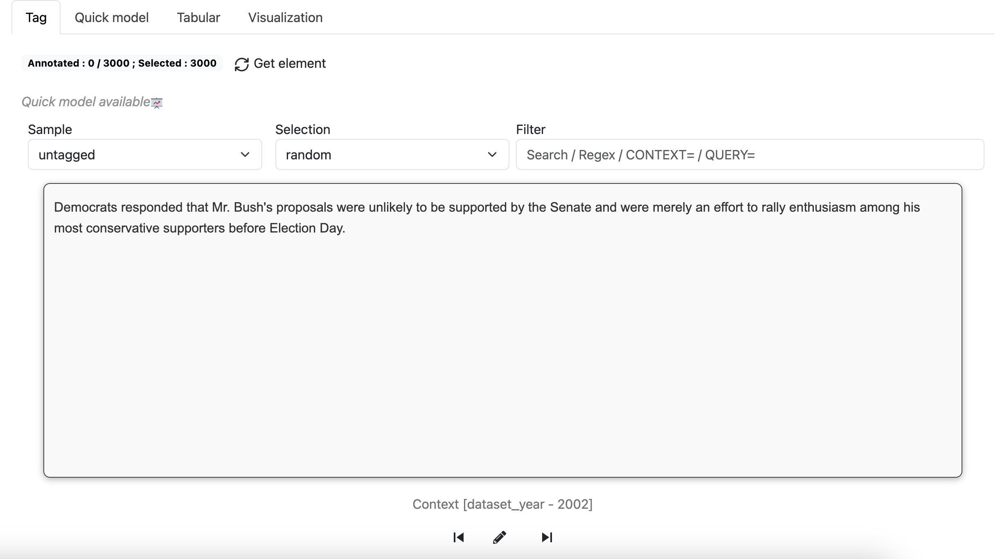

# ActiveTigger Quickstart

This is how to get started with your annotation project with ActiveTigger.

This guide explains the basics of all functionalities, but you do not have to use all of them for your project. For example, if you only want to use ActiveTigger for manual annotation, you do not have to use the "Active Learning" or "Validation" functionalities.

## Table of contents
1. [Creating a project](#creating-a-project)
2. [Project tab](#project-page)
3. [Explore](#explore)
4. [Prepare](#prepare)
5. [Annotate](#annotate)
6. [Validation](#validation)
7. [Export](#export)

## Creating a project

You need a `csv`, `xlsx` or `Parquet` file with your texts separated at the level you wish to annotate (sentences, paragraphs, social media posts, articles...). These will be loaded as the elements that you can individually annotate.

Give your project a name. **Be aware that both the project name and the id will be transformed to be url-compatible. This means for instance that accentuated characters will be replaced by their non-accentuated equivalent, and spaces/underscores will be replaced by dash.**

Specify the name of the column that contains the unique (numerical or textual) IDs for each element, and the name of the column that contains the text. Specify the language of the texts. If the text is separated across several columns, you can indicate all relevant columns.

Optionally, if the file has already been annotated or contains important context elements that you want to see while annotating (for example the author, the date, the publication...), you can specify the relevant columns here.

Specify the number of elements you want to annotate in the training set. For the moment, you cannot add additional elements later, you will need to create a new project. Elements are picked randomly in the uploaded file, prioritizing elements that have already been annotated if any.

Importing a test set is not mandatory. Further down the line, if you would like to validate your model on a test set, this will be possible at a later stage.

## Project page

Click on the name of your project in the left-hand menu to see a summary of your annotations.

Every project can have several coding **schemes**. A scheme is a set of specific labels that you can use to annotate the corpus. Each scheme works as a layer of annotation. 

You can create a new coding scheme or delete an old one in the menu at the top. Creating a new coding scheme means starting from zero, but will not modify previous coding schemes. You can toggle between schemes as you go.

You can also see a summary of all your current annotations (per category), a history of all your actions in the project, and a summary of the parameters you set up while creating your project. You can also delete the project in the Parameters tab.

Once you entered the annotation phase, you will have an history of already annotated elements. This is the session history. *Be aware that you can only see once an element in a session, so if you need to re-annotate them, you will need to clear the history first.*

## Explore

The **Explore** tab gives you an overview of your data. You can filter to see elements with certain keywords or regex patterns and get an overview of your annotations so far.

## Prepare

Before annotating, you need to define your labels.

We recommend keeping your labels simple. If you are aiming to train a model, binary categorizations tend to be easier to handle. For example, if you are annotating newspaper headlines, it is easier to classify it as "politics/not politics", rather than to include all possible subjects as multiple categories. You can layer different binary categorizations as different coding scheme, or add labels at a later stage.

Enter the name of each label under "New label" and click the plus sign.

You can also delete or replace labels. 

- If you want to delete a label, pick the relevant label under **Available labels** and then the trash bin. All existing annotations will be deleted.
- If you want to replace a label, pick the relevant label under **Available labels**, write the label's new name, and click the sign next to **Replace selected label**. All the existing annotations will be converted to the new label.

Under the **Codebook** tab, you can also include written instructions on how to distinguish your categories.

## Annotate

In the **Annotate** section, the interface will pick out an element that you can annotate according to your pre-defined labels. Once you have picked a label, the interface will pick the next element for you.

By default, the selection modes "deterministic" and "random" are available:

- **Deterministic** mode means that ActiveTigger will pick out each element in the order of the database, created at the beginning.
- **Random** mode means that ActiveTigger will pick out the next element at random.

Click on **Get element** if you want to apply a new selection mode.

You can search for elements with particular keywords or _regex_ patterns. This could mean fishing out all elements that contain certain symbols, for example. If you are unfamiliar with regex patterns, [this generator](https://regex-generator.olafneumann.org/) can be a useful reference.

### Active learning

Often, we want to classify imbalanced datasets, i.e. where one category is much less represented in the data than the other. This can mean very lengthy annotation processes, if you go through each element in a random order hoping to stumble upon both of your categories. **Active learning** is a method to accelerate the process.

ActiveTigger can find the elements that your current model is either _most certain_ or _most uncertain_ that it knows how to predict, given your existing coding scheme and annotations. Here is how to set it up:

First, make sure you have a _feature_ selected under the **Prepare** tab (by default, we recommend sbert).

Second, you need to train a current prediction model based on the annotations you have made so far. You do this at the bottom of the annotation tab.

Once the prediction model is trained, you can now choose the _active_ and _maxprob_ selection modes when picking elements.

**Active** mode means that Active Tigger will pick the elements on which it is most uncertain (where, based on previous annotations, it could be classified either way)

**Maxprob** mode means that Active Tigger will pick the elements on which it is most certain (where, based on previous annotations, the model guesses where to categorize it with the highest levels of confidence).

When constructing your training dataset, we recommend starting in random mode in order to create a base of annotations on which to train a prediction model. There is no absolute minimum number. A couple dozen annotations representing both of your labels can serve as a base.

Then, we recommend alternating between active and maxprob mode in order to maximize the number of examples from both of your categories.

Above your available labels, the **Prediction** button indicates the model's prediction of a certain label (given previous annotations) and its level of certainty.

## Validation

Active Tigger also lets you train a BERT classifier model on-the-go, allowing you to assess how well such a model works given your current annotations.

This is done on the **Train** tab. Click on **New Model** to train a new model.

Name it and pick which BERT model base you would like to use (note that some are language-specific).

You can adjust the parameters for the model, or leave it at default values.

Leave some time for the training process. Once the model is available, you can consult it under the **Models** tab.

Choose the name of the model under **Existing models**, click on the **Scores tab**, and click **Predict using train set**.

Once the prediction is done, you will see a series of scores:

_F1 micro_: The harmonic mean of precision and recall, calculated globally without considering category imbalance.

_F1 macro_: The harmonic mean of precision and recall calculated per class, treating all categories equally regardless of their size.

_F1 weighted_: The harmonic mean of precision and recall calculated per class, weighted by the number of true instances in each category to account for imbalance.

_F1_: The harmonic mean of precision and recall (shown per each label)

_Precision_: Proportion of correctly predicted positive cases out of all predicted positives.

_Recall_:  Proportion of correctly predicted positive cases out of all actual positives.

_Accuracy_: Proportion of correctly classified elements out of total elements.

All of these variables tell you useful information about how your model performs, but the way you assess them depends on your research question. 

For example, say that you are classifying social media posts according to whether they express support for climate policies or not. A low precision score means many posts labeled as "supportive" are actually irrelevant or against climate change policies (false positives). A low recall means the model misses many supportive posts (false negatives). Improving precision might involve stricter rules for classifying posts as supportive (e.g., requiring multiple positive keywords). However, this could hurt recall, as subtle supportive posts might be overlooked.

The generic **F1 score** is often the variable most of interest, as it indicate how precision and recall are balanced. The closer the F1 score is to 1, the better the model performs according to the coding scheme you have trained it on. 

If you find yourself with low scores, it is a good idea to first consider your coding scheme. Are your categories clear? Several rounds of iterative annotations are often necessary as you refine your approach.

## Export

You can export your total annotations in `csv`, `xlsx` or `parquet` format.

On the Export tab, select the desired format and click **Export training data**.

You can also export the features and models you have trained if you wish to use them elsewhere.