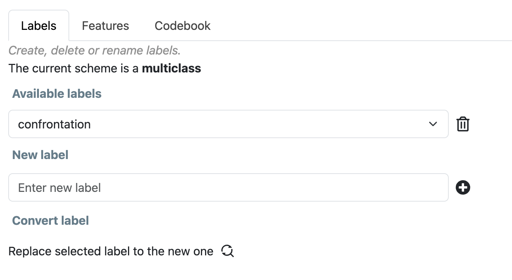
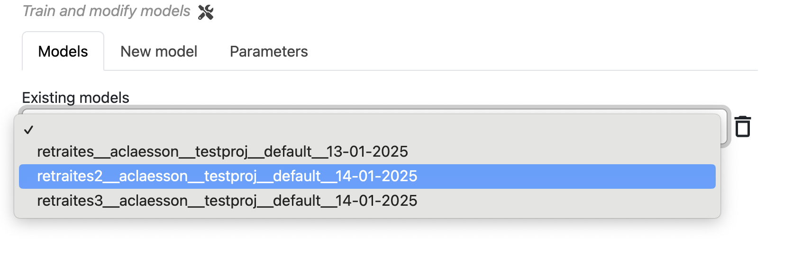

# ActiveTigger Quickstart

This is how to get started with your annotation project with ActiveTigger. It will be useful if you want to:

- Quickly annotate a text-based dataset in a dedicated collaborative interface
- Train a model on a small set of annotated data to extend it on a larger corpus

This guide explains the basics of all functionalities, but you do not have to use all of them for your project. For example, if you only want to use ActiveTigger for manual annotation, focus on the sections detailing how to set up and export your project data.

!!! warning "ActiveTigger is in beta"

    ActiveTigger is still in beta, and we are working on improving it. If you encounter any issues, please let us know on [Github issues](https://github.com/emilienschultz/activetigger/issues)

_Note: ActiveTigger currently only works for multiclass/multilabel annotation, not span annotation._

## Table of contents
1. [Creating a project](#creating-a-project)
2. [Project tab](#project-page)
3. [Explore](#explore)
4. [Prepare](#prepare)
5. [Annotate](#annotate)
6. [Validation](#validation)
7. [Export](#export)
8. [Users management](#users-management)
9. [Account](#account)

## Creating a project

Creating the project is the most important step, since it will define the framework of your annotation process.

First, you need to import the **raw data** : a `csv`, `xlsx` or `parquet` file with your texts separated at the level you wish to annotate (sentences, paragraphs, social media posts, articles...). Each element should be a row. These will be loaded as the elements that you can individually annotate.

Give your project a name (the **project name**). Each name is unique in the application and will allow you to identify your project.

!!! info "Name and id can be transformed"

    Both the project name and the ID will be transformed to be url-compatible. This means for instance that accentuated characters will be replaced by their non-accentuated equivalent, and spaces/underscores will be replaced by a dash.

Specify the name of the column that contains the unique (numerical or textual) IDs for each element (**id columns**), and the name of the column (or columns) that contains the text (**text(s) columns**). Specify the language of the texts.

If the file has already been annotated and you want to import these annotations, you can specify the column of **existing annotations**.

Optionally, if there are **context elements** that you want to see while annotating (for example the author, the date, the publication...), you can specify the relevant columns here.

The next step is to define both the **training dataset** that you will annotate and an optional **test dataset** that can be used for model evaluation.

The **training dataset** is the most important since it will be the elements that you will be able to see and annotate.

You need to specify the number of elements you want in each dataset. Those elements will be picked randomly in the **raw data**, prioritizing elements that have already been annotated if any for the **training dataset**.

Using a test set is not mandatory. Further down the line, if you would like to validate your model on a test set, this will be possible at a later stage.

!!! info "Size of the dataset"

    For the moment, you cannot add additional elements later. For  this, you will need to create a new project.

Once the project is created, you can start working on it.

!!! info "Visibility"

    By default, a project is only visible to the user who created it. You can add users on a project if you want to work collaboratively.

## Project page

Click on the name of your project in the left-hand menu to see a summary of your situation.

Every project can have several **coding schemes**. A scheme is a set of specific labels that you can use to annotate the corpus. Each scheme works as a layer of annotation. One is created by default when you create a project.

You can create a new coding scheme or delete an old one in the menu at the top. Creating a new coding scheme means starting from zero, but will not modify previous coding schemes. You can toggle between schemes as you go.

!!! info "Coding schemes"

    There are two different coding schemes : multi-class and multi-label (experimental). Multi-class means one label per element; multi-label means several labels per element. You cannot switch between them, and multi-label are for the moment not completely implemented in the interface.

You can also see a summary of all your current annotations (per category), a history of all your actions in the project, and a summary of the parameters you set up while creating your project. You can also delete the project in the Parameters tab once you finished with it.

!!! info "Destroy a project"

    Be aware that deleting a project will delete all the annotations and the project itself. But it will also release space for other projects, so please don't hesitate to clean.

Once you entered the annotation phase, you will have an history of already annotated elements. This is the session history. 

!!! warning "Session history"

    Be aware that you can only see any particular element once during a unique session, so if you need to re-annotate them, you will need to clear the history first.

## Explore

The **Explore tab**  gives you an overview of your data. You can filter to see elements with certain keywords or regex patterns and get an overview of your annotations so far.

## Prepare

### Define labels

Before annotating, you need to define your labels.

We recommend keeping your labels simple. If you are aiming to train a model, binary categorizations tend to be easier to handle. For example, if you are annotating newspaper headlines, it is easier to classify it as "politics/not politics", rather than to include all possible subjects as multiple categories. You can layer different binary categorizations as different coding scheme, or add labels at a later stage.

Enter the name of each label under "New label" and click the plus sign.

You can also delete or replace labels. 

- If you want to delete a label, pick the relevant label under **Available labels** and then the trash bin. All existing annotations will be deleted.
- If you want to replace a label, pick the relevant label under **Available labels**, write the label's new name, and click the sign next to **Replace selected label**. All the existing annotations will be converted to the new label.

### Define features

The **Prepare** tab also lets you define the **features** you want to use for your model. By default, we recommend using the `sbert` feature, which is a pre-trained model that converts your text into a numerical representation. This is a good starting point for most projects.

Features means that each text element is represented by a numerical vector. This is necessary to train certain models (especially for active learning) or to do projections.

### Write your codebook

Under the **Codebook** tab, you can also include written instructions on how to distinguish your categories.

## Annotate

The **Annotate** tab is where you will spend most of your time.

### Selection mode

In the Annotate section, the interface will pick out an element that you can annotate according to your pre-defined labels. Once you have picked a label, the interface will pick the next element for you following the **selection mode** that is configured.

By default, the selection modes "deterministic" and "random" are available:

- **Deterministic** mode means that ActiveTigger will pick out each element in the order of the database, as created when creating your project.
- **Random** mode means that ActiveTigger will pick out the next element at random.

Click on **Get element** if you want to apply a new selection mode.

The selection mode refers both the general rule of getting new elements (e.g. random) and specific rules, such as specified regular expressions (_regex_) patterns. You can search for elements with particular keywords or particular syntax patterns (regex). This could mean fishing out all elements that contain certain symbols, for example. If you are unfamiliar with regex patterns, [this generator](https://regex-generator.olafneumann.org/) can be a useful reference.

!!! info "Keyboard shortcuts"

    You can use the keyboard shortcuts to annotate faster. The number keys correspond to the labels you have defined. You can move the labels to change the order if needed.

!!! info "Add comment"

    You can add a comment to each annotation. This can be useful to explain why you chose a certain label, or to note any particularities about the text.

### Active learning

Often, we want to classify imbalanced datasets, i.e. where one category is much less represented in the data than the other. This can mean very lengthy annotation processes, if you go through each element in a random order hoping to stumble upon both of your categories. 

**Active learning** is a method to accelerate the process.

Using the already annotated data, ActiveTigger can find the elements that your current model is either _most certain_ or _most uncertain_ that it knows how to predict, given your existing coding scheme and annotations. Here is how to set it up:

First, make sure you have a _feature_ selected under the **Prepare** tab (by default, we recommend sbert).

Second, you need to train a current prediction model based on the annotations you have made so far. You do this at the bottom of the annotation tab. The basic parameters can be used for the first model, to fine-tune later.

Once the prediction model is trained, you can now choose the _active_ and _maxprob_ selection modes when picking elements.

- **Active** mode means that Active Tigger will pick the elements on which it is most uncertain (where, based on previous annotations, it could be classified either way)
- **Maxprob** mode means that Active Tigger will pick the elements on which it is most certain (where, based on previous annotations, the model guesses where to categorize it with the highest levels of confidence).

When constructing your training dataset, we recommend starting in random mode in order to create a base of annotations on which to train a prediction model. There is no absolute minimum number. A couple dozen annotations representing both of your labels can serve as a base.

If the aim is to train a model, we recommend alternating between active and maxprob mode in order to maximize the number of examples from both of your categories prioritizing on the _uncertain_ elements.

Above your available labels, the **Prediction** button indicates the model's prediction of a certain label (given previous annotations) and its level of certainty (you can deactivate it in **Display parameters**)

## Fine-tune your BERT classifier

Active Tigger allows you to train a BERT classifier model on your annotated data with two goals: extending your annotation on the complete dataset, or retrieving this classifier for other uses.

This is done on the **Train** tab. Click on **New Model** to train a new model.

Name it and pick which BERT model base you would like to use (note that some are language-specific).

You can adjust the parameters for the model, or leave it at default values.

Leave some time for the training process. It can take some time depending on the number of elements. Once the model is available, you can consult it under the **Models** tab.

For the moment, you only have the model. Now, you can decide to apply it on your data, either to see metrics of its performance, or to extend it on the whole dataset.

Choose the name of the model under **Existing models**, click on the **Scores tab**, and click **Predict using train set**. it will use the model on the train dataset (so on the elements you haven't annotated yet).

Once the prediction is done, you will see a series of scores that allows you to evaluate the model's performance.:

- _F1 micro_: The harmonic mean of precision and recall, calculated globally without considering category imbalance.
- _F1 macro_: The harmonic mean of precision and recall calculated per class, treating all categories equally regardless of their size.
- _F1 weighted_: The harmonic mean of precision and recall calculated per class, weighted by the number of true instances in each category to account for imbalance.
- _F1_: The harmonic mean of precision and recall (shown per each label)
- _Precision_: Proportion of correctly predicted positive cases out of all predicted positives.
- _Recall_:  Proportion of correctly predicted positive cases out of all actual positives.
- _Accuracy_: Proportion of correctly classified elements out of total elements.

All of these variables tell you useful information about how your model performs, but the way you assess them depends on your research question. 

For example, say that you are classifying social media posts according to whether they express support for climate policies or not. A low precision score means many posts labeled as "supportive" are actually irrelevant or against climate change policies (false positives). A low recall means the model misses many supportive posts (false negatives). Improving precision might involve stricter rules for classifying posts as supportive (e.g., requiring multiple positive keywords). However, this could hurt recall, as subtle supportive posts might be overlooked.

The generic **F1 score** is often the variable most of interest, as it indicate how precision and recall are balanced. The closer the F1 score is to 1, the better the model performs according to the coding scheme you have trained it on. 

If you find yourself with low scores, it is a good idea to first consider your coding scheme. Are your categories clear? Several rounds of iterative annotations are often necessary as you refine your approach.

Once you find the model satisfactory, you can apply it to the whole dataset in the tab **Compute prediction**. This will apply the model to all the elements in the dataset, and you can then export the results.

## Test your model

If you have a test set, you can also apply the model on it. This is useful to see how the model performs on unseen data.

!!! warning "Under development"
    
        This feature is still under development and might not work as expected - watch this space!

## Export

You can export your total annotations in `csv`, `xlsx` or `parquet` format.

On the Export tab, select the desired format and click **Export training data**.

You can also export the features and models you have trained if you wish to use them elsewhere.

## Users management

You can add users to your project. This is useful if you want to work collaboratively on a project.

!!! note "Create user"

    The right to create users is restricted.

## Account

You can change your password.